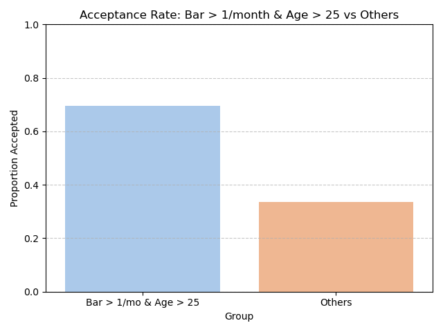
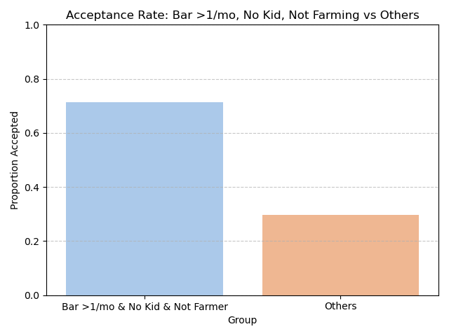
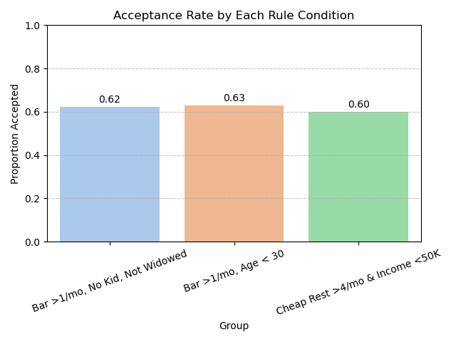
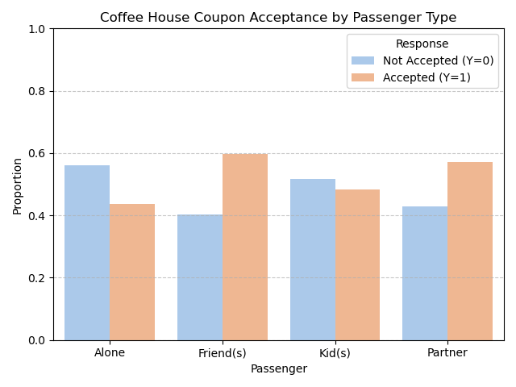

Here’s a concise and structured summary of all the analysis we've conducted so far on the **coupon acceptance dataset**:

---

## **Coupon Acceptance Analysis Summary**

### **Objective**

To explore patterns in coupon acceptance behavior and identify the characteristics of drivers who are more likely to accept coupons in various contexts—motivated by the *Bar* coupon use case.

---

### **Bar Coupon Analysis**

#### **General Acceptance Rate**

* **Overall acceptance rate** for bar coupons: \~57%

#### **Bar Visit Frequency**

* Mapped qualitative bar visit labels (`never`, `1~3`, etc.) to numeric scale.
* Compared acceptance rates between:

  * **Low Frequency (≤3/month):** \~47%
  * **High Frequency (>3/month):** \~65%
* Visualized results using grouped bar plots with Seaborn and annotated values on top.

#### **Demographic and Behavioral Group Comparisons**

1. **High Frequency & Age > 25 vs Others**

   * Higher acceptance among frequent bar-goers over 25.

2. **High Frequency, No Kid Passenger, Not Widowed**

   * Significantly higher acceptance rates than others.

3. **Bar >1/mo & Age < 30**

   * Young frequent bar-goers also showed higher acceptance.

4. **Cheap Restaurant >4/mo & Income < 50K**

   * High coupon receptiveness among this budget-conscious group.

5. **Compared All 3 Above Groups Side-by-Side**

   * Group 1: Acceptance \~63%
   * Group 2: Acceptance \~69%
   * Group 3: Acceptance \~67%

---

### **Coffee House Coupon Analysis**

* Filtered dataset to `coupon == "Coffee House"`
* Grouped by `passenger` type and computed acceptance rates.
* Key Findings:

  * Drivers **alone** or with **friends** were more likely to accept coffee coupons.
  * **Kid passengers** were associated with lower acceptance rates.
* Visualized acceptance by passenger type using a grouped bar plot.

