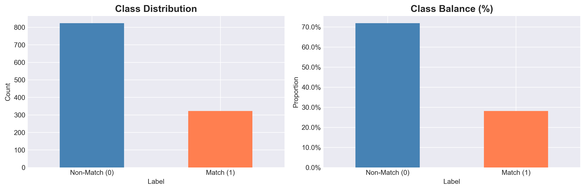
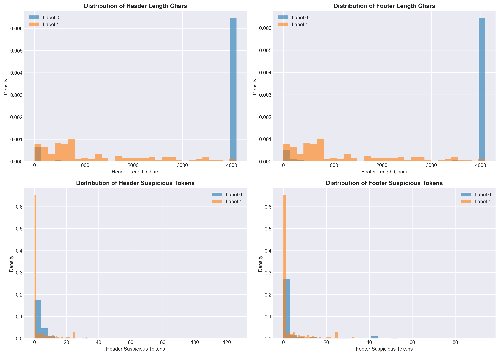
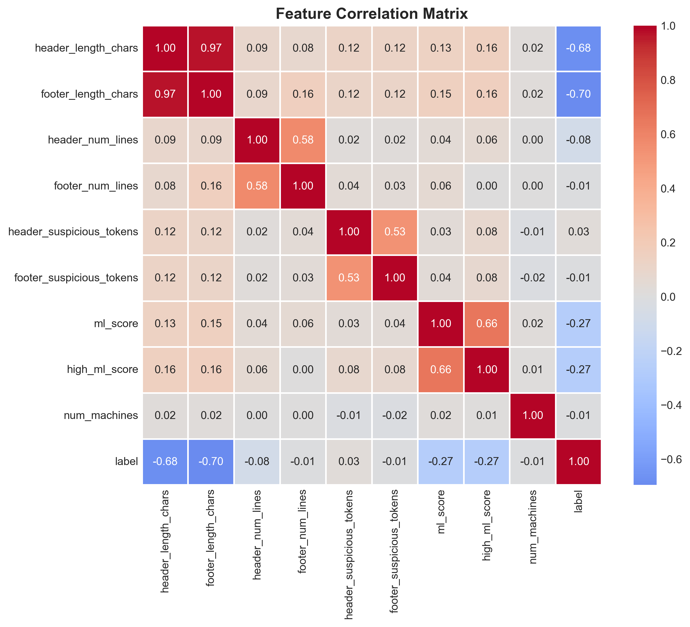
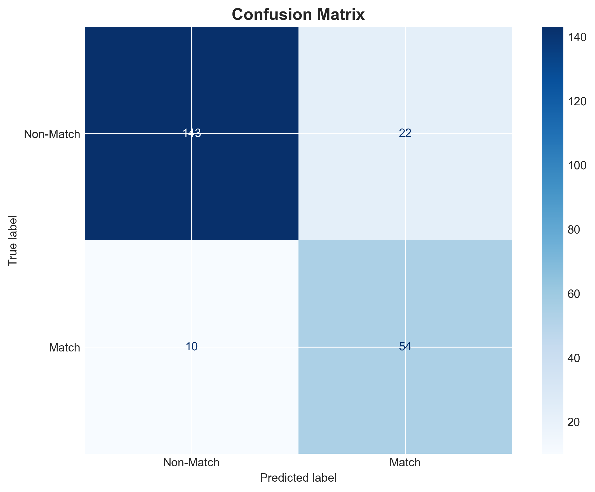
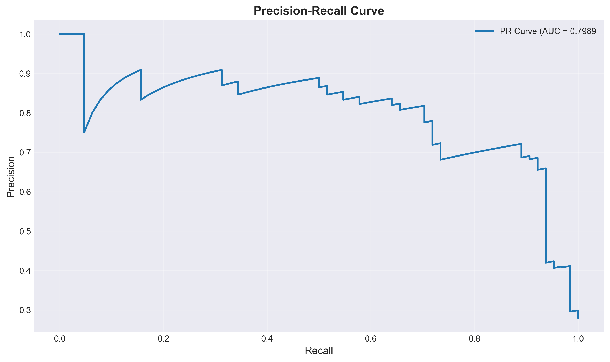

# Module 20 - Non-PE Script Classification

**UC Berkeley Professional Certificate in ML & AI - Capstone Project**

## Project Overview

This project develops a **baseline machine learning classifier** to distinguish malicious from clean non-PE (non-Portable Executable) script files. Using metadata and structural features extracted from script content, the model achieves strong performance metrics suitable for security applications.

**Link to Analysis:** [module20_eda_baseline.ipynb](./module20_eda_baseline.ipynb)

---

## Dataset Overview

**Note:** Dataset files are proprietary and not included in this repository.

### Dataset Characteristics

| Attribute | Value |
|-----------|-------|
| **Total Samples** | 1,145 |
| **Match (Malicious)** | 322 (28.1%) |
| **Non-Match (Clean)** | 823 (71.9%) |
| **Features** | 13 columns |
| **Duplicates** | 0 |
| **Missing Values** | Present in some columns (handled during preprocessing) |

### Key Features Used

- **Sha256**: File hash identifier
- **Machines**: Number of machines where file was observed
- **ML**: Machine Learning detection score (0-1)
- **HeaderDecoded**: Beginning portion of script content
- **FooterDecoded**: Ending portion of script content
- **IsMatch**: Binary label (0=Non-Match, 1=Match) - **Target Variable**

## Data Cleaning and Preprocessing

### Cleaning Steps

1. **Duplicate Removal**: Verified no duplicate rows exist (0 duplicates found)
2. **Missing Value Analysis**: Identified columns with missing values and handled appropriately
3. **Outlier Detection**: Applied IQR method to detect anomalies
   - **ML Score**: No outliers detected
   - **Machines**: 182 outliers (15.9%) - retained as they represent legitimate high-distribution files
4. **Feature Creation**: Engineered 9 new features from raw data

### Feature Engineering

Created **9 engineered features** across three categories:

#### 1. Header/Footer Content Features (6 features)
| Feature | Description |
|---------|-------------|
| `header_length_chars` | Character count in HeaderDecoded |
| `footer_length_chars` | Character count in FooterDecoded |
| `header_num_lines` | Number of lines in HeaderDecoded |
| `footer_num_lines` | Number of lines in FooterDecoded |
| `header_suspicious_tokens` | Count of malicious patterns in header |
| `footer_suspicious_tokens` | Count of malicious patterns in footer |

**Suspicious Tokens Detected:** `fromCharCode`, `atob`, `eval`, `WScript`, `powershell`, `Invoke-Expression`, `iex`, `DownloadString`, `DownloadFile`, `Shell`, `exec`, `CreateObject`, `ActiveXObject`

#### 2. ML Score Features (2 features)
| Feature | Description |
|---------|-------------|
| `ml_score` | Continuous ML detection score (0-1) |
| `high_ml_score` | Binary indicator (ml_score > 0.02) |

#### 3. Metadata Features (1 feature)
| Feature | Description |
|---------|-------------|
| `num_machines` | Number of machines observing the file |

## Exploratory Data Analysis (EDA)

### Class Distribution
- **Reasonably Balanced**: 28% Match, 72% Non-Match
- Suitable for supervised learning without extreme resampling

### Feature Distribution Insights

| Feature Category | Key Finding |
|------------------|-------------|
| **Header/Footer Length** | Non-Match files have significantly longer headers/footers; Match files often have truncated or obfuscated content |
| **Suspicious Tokens** | Match files contain more malicious patterns (eval, powershell, etc.) |
| **ML Score** | Strong discriminator - Match files have lower ML scores on average |

### Correlation Analysis

**Strongest Correlations with Target (label):**
- `footer_length_chars`: -0.70 (strong negative)
- `header_length_chars`: -0.68 (strong negative)
- `ml_score`: -0.27 (moderate negative)

**Feature Collinearity:**
- Header and footer lengths are highly correlated (0.97)
- Suspicious token counts are moderately correlated (0.53)

### Visualizations

#### Class Distribution

*Figure 1: Class balance showing 28% Match (malicious) vs 72% Non-Match (clean) files*

#### Feature Distributions by Label

*Figure 2: Key features show different distributions between Match and Non-Match classes. Header/footer lengths and suspicious token counts are strong discriminators.*

#### Correlation Matrix

*Figure 3: Heatmap showing feature correlations. Header and footer lengths are highly correlated (0.97) and negatively correlated with the malicious label (-0.68, -0.70).*

## Machine Learning Model

### Model Selection: Logistic Regression

**Rationale for Model Choice:**
- **Interpretability**: Provides coefficient values showing feature importance
- **Efficiency**: Fast training and prediction for baseline evaluation
- **Probabilistic Output**: Enables threshold tuning for operational requirements
- **Established Baseline**: Standard first model for binary classification

**Configuration:**
```python
LogisticRegression(
    max_iter=1000,
    class_weight='balanced',  # Handles 28/72 class imbalance
    random_state=42           # Ensures reproducibility
)
```

### Training Configuration

| Parameter | Value |
|-----------|-------|
| **Train/Test Split** | 80/20 (stratified) |
| **Training Samples** | 916 |
| **Test Samples** | 229 |
| **Input Features** | 9 engineered features |
| **Target Variable** | `label` (0=Non-Match, 1=Match) |

## Model Performance

### Evaluation Metrics (Threshold = 0.5)

| Metric | Value | Interpretation |
|--------|-------|----------------|
| **ROC-AUC** | **0.9172** | Excellent discrimination ability |
| **PR-AUC** | **0.7989** | Strong performance on imbalanced data |
| **Precision** | 0.7105 | 71% of flagged files are actually malicious |
| **Recall** | 0.8438 | 84% of malicious files are detected |
| **F1-Score** | 0.7714 | Balanced harmonic mean |

### Why These Metrics?

**ROC-AUC (Area Under ROC Curve):**
- Evaluates performance across all classification thresholds
- Value of 0.92 indicates excellent separation between classes
- Threshold-independent measure of model quality

**PR-AUC (Precision-Recall AUC):**
- Better suited for imbalanced datasets than ROC-AUC
- Focuses on positive class (Match) performance
- Value of 0.80 confirms strong predictive power

**Precision & Recall:**
- **Precision**: Minimizes false alarms (clean files flagged as malicious)
- **Recall**: Maximizes threat detection (catches actual malicious files)
- Trade-off tunable via threshold adjustment

### Confusion Matrix


*Figure 4: Model performance on test set showing strong classification accuracy*

|  | Predicted: Non-Match | Predicted: Match |
|---|---------------------|-----------------|
| **Actual: Non-Match** | 143 (TN) | 22 (FP) |
| **Actual: Match** | 10 (FN) | 54 (TP) |

**Results:**
- ✅ **True Positives**: 54 - Correctly identified malicious files
- ✅ **True Negatives**: 143 - Correctly identified clean files
- ❌ **False Positives**: 22 - Clean files incorrectly flagged
- ❌ **False Negatives**: 10 - Malicious files missed

**Overall Accuracy**: 86.0%

### Precision-Recall Curve


*Figure 5: PR-AUC of 0.80 demonstrates strong model performance across all thresholds*

### Threshold Analysis

| Threshold | Precision | Recall | F1-Score | Use Case |
|-----------|-----------|--------|----------|----------|
| **0.5** | 0.7105 | **0.8438** | **0.7714** | Recommended - balanced |
| 0.7 | 0.6857 | 0.7500 | 0.7164 | Moderate security |
| 0.8 | 0.7188 | 0.7188 | 0.7188 | Equal precision/recall |
| 0.9 | **0.8500** | 0.5312 | 0.6538 | High confidence only |

## Key Findings

### What Works ✅

1. **Excellent Model Performance**
   - ROC-AUC of 0.92 demonstrates strong discrimination capability
   - PR-AUC of 0.80 confirms robustness on imbalanced data
   - 84% recall ensures most malicious files are caught

2. **Effective Feature Engineering**
   - Header/footer length features show strong negative correlation with malicious label
   - Suspicious token counts successfully identify malicious patterns
   - ML score integration enhances predictive power

3. **Interpretable Results**
   - Logistic regression coefficients reveal feature importance
   - Clear understanding of what drives predictions
   - Threshold tunability for operational flexibility

### Challenges & Limitations 🔍

| Challenge | Impact | Mitigation |
|-----------|--------|------------|
| **False Positives** | 22 clean files flagged (13% FP rate) | Adjust threshold to 0.8 or 0.9 |
| **False Negatives** | 10 malicious files missed (16% FN rate) | Keep threshold at 0.5 for max recall |
| **Feature Collinearity** | Header/footer lengths 97% correlated | Consider dimensionality reduction |
| **Limited Semantics** | Structural features only, not content-aware | Future: LLM embeddings |

### Feature Importance

**Most Predictive Features** (by logistic regression coefficients):

| Feature | Direction | Interpretation |
|---------|-----------|----------------|
| `footer_length_chars` | ➖ Negative | Longer footers → cleaner files |
| `header_length_chars` | ➖ Negative | Longer headers → cleaner files |
| `ml_score` | ➖ Negative | Higher ML score → Match files |
| `suspicious_tokens` | ➕ Positive | More tokens → malicious |

**Insight**: Malicious files often have truncated or obfuscated content (shorter headers/footers) with embedded suspicious patterns.

## Future Improvements

- **LLM Integration**: Generate semantic embeddings from script content
- **Deep Learning**: LSTM/Transformer models for sequential analysis
- **Ensemble Methods**: Combine multiple model predictions
- **Production Deployment**: Real-time API with monitoring

## Project Organization

### Repository Structure


**Note**: Dataset files are proprietary and excluded from repository.


## Summary

This project successfully develops a **baseline classifier** for malicious script detection, achieving:

- ✅ **ROC-AUC: 0.92** - Excellent discrimination
- ✅ **PR-AUC: 0.80** - Strong performance on imbalanced data
- ✅ **84% Recall** - High threat detection rate
- ✅ **71% Precision** - Acceptable false positive rate

**Key Success Factors:**
1. Effective feature engineering from script content
2. Proper handling of class imbalance
3. Appropriate metric selection for security context
4. Interpretable model with actionable insights

---

**Author**: Reza Tajvidi, for UC Berkeley ML & AI Professional Certificate - Module 20 Capstone  
**Date**: December 2025  
**Link to Notebook**: [module20_eda_baseline.ipynb](./module20_eda_baseline.ipynb)
